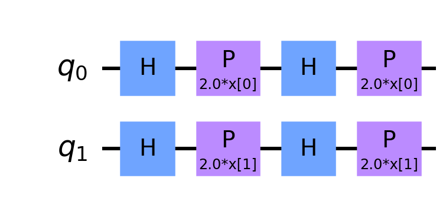

# Qiskit Machine Learning

Machine learning with Qiskit.

- Machine learning in quantum computing
- Quantum support vector machine (QSVM)
- SVM with custom quantum kernel

## Accuracy Comparison

Used ad hoc dataset

- Input dimension 2
- Output demension 1
- Training 50
- Test 10

| | Accuracy |
|---|---|
| Classical SVM | 70% |
| Custom kernel | 50% |
| QSVM | 100% |

## Kernels

### ZFeatureMap

### ZZFeatureMap

## Dependency

- Python 3
- Qiskit
- qiskit_machine_learning
- pylatexenc
- matplotlib
- numpy
